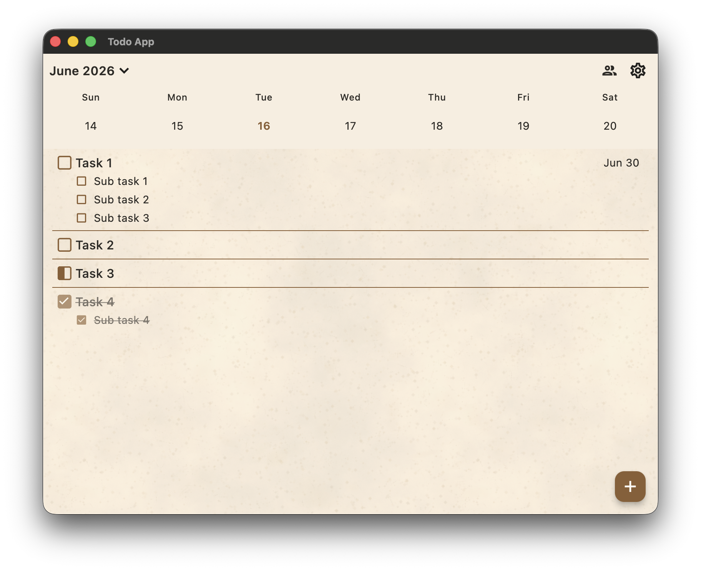
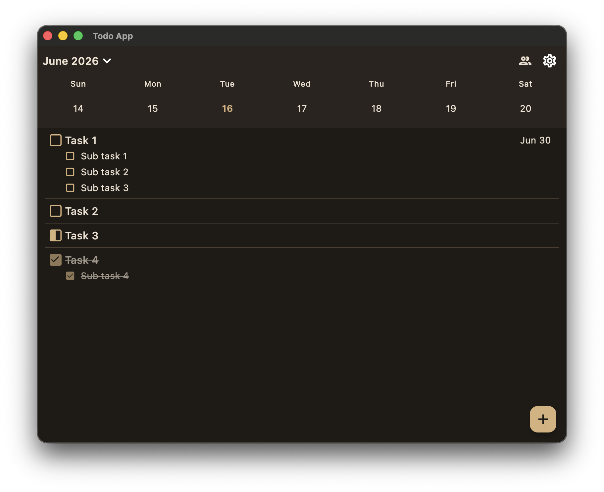
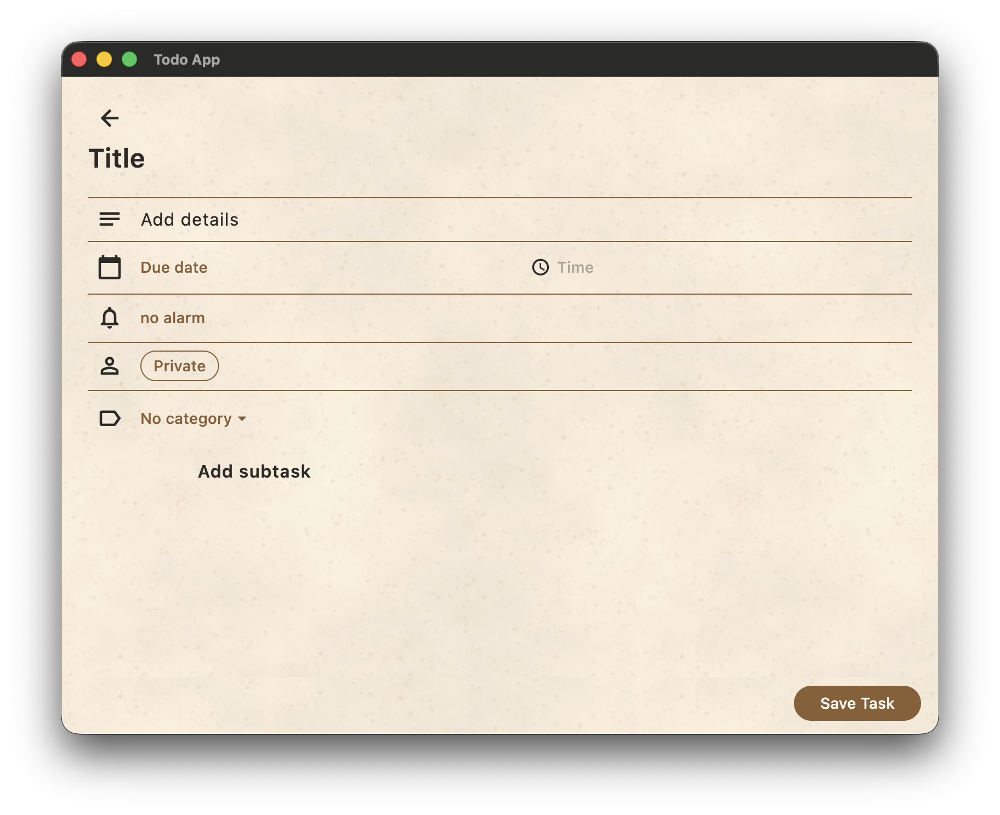
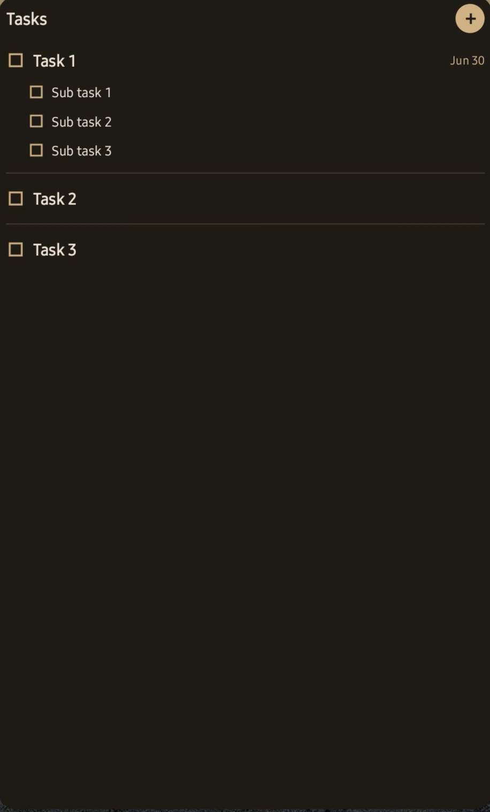
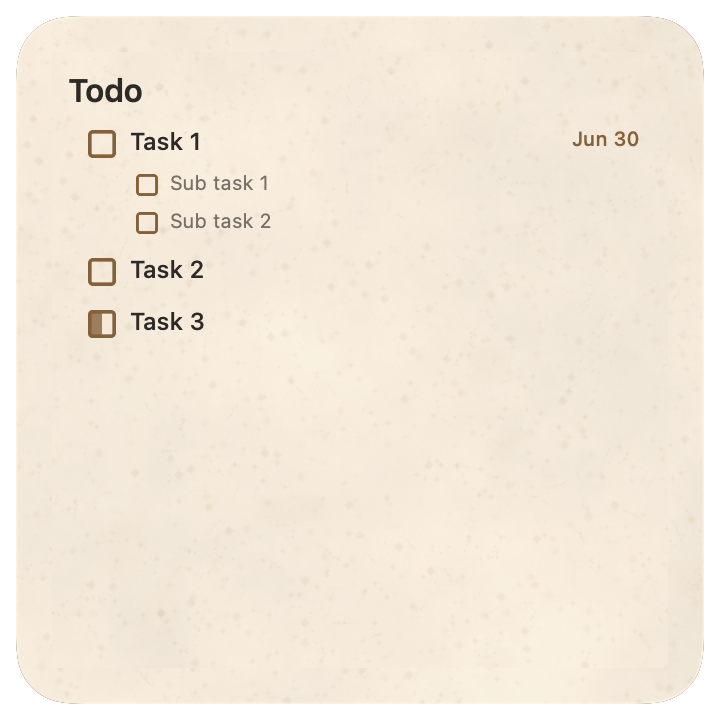
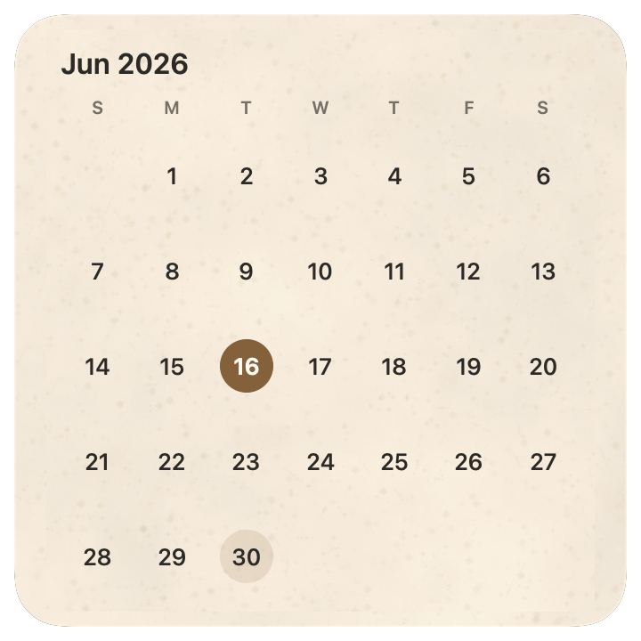

# Personal Todo

[English](#personal-todo) | [한국어](#한국어)

This is a to-do app for me and my partner with Mac, Android, and iOS compatibility. I made this because some to-do apps have too many functions, and some to-do apps have no useful functions.

This repository contains both the Flutter client and the Python/FastAPI sync backend.

| Light Mode Home | Dark Mode Home | Task Editor |
| :---: | :---: | :---: |
|  |  |  |

| Android Widget | Mac Desktop Todo Widget | Mac Desktop Calendar Widget |
| :---: | :---: | :---: |
|  |  |  |

## Key Features

* **Cross-Platform Sync:** Runs on Mac, Android, and iOS with an offline-first sync queue, retry state, and last-sync visibility.
* **Shared Completions:** Task models can be configured to require completion by either one user or both users.
* **Subtasks & Aggregates:** Complex data structures that sync atomically.
* **Widgets:** Native Android and macOS widgets integrated via Method Channels; Android widget completion actions route through the Flutter repository so sync metadata stays consistent.

## Architecture

The repository is structured as a monorepo containing both the mobile app and the backend server.

### 1. Mobile Client (Flutter)
The mobile app is built with Flutter using Clean Architecture principles.
* **Local Storage:** Driven by `sqflite`. The `LocalTodoRepository` acts as the single source of truth for the UI.
* **Sync Queue:** Every mutation generates a JSON payload that is added to a local sync queue table.
* **State Management:** Reactive updates using `ChangeNotifier` to decouple the UI from networking logic.
* **Testing:** The client includes a Flutter test suite covering UI components, local repository state manipulation, native widget actions, and sync protocol logic.

### 2. Backend Server (Python)
The backend is a REST API that acts as the synchronization hub.
* **Framework:** `FastAPI`
* **Database:** `PostgreSQL` interacted with via `SQLAlchemy`.
* **Sync Protocol:** The server resolves conflicts on a per-field basis using timestamps, accepting pushed queues and providing an incremental cursor-based pull API.
* **Deployment:** Containerized for deployment via `docker-compose`.

## Running it for Yourself

This app is fully functional and can be deployed for personal use. A self-hosted backend API is required.

The **Oracle Cloud Free Tier** provides an "Always Free" Linux VM capable of running the backend and Postgres database for two users.

### Step-by-Step Setup

1. **Deploy the Server:**
   * Create an Oracle Cloud VM (or an equivalent VPS).
   * Point a domain name to your VM's IP address.
   * SSH into your server, install Docker, and clone this repository.
   * See the deployment instructions in [`server/deploy/README_ORACLE_VM.md`](server/deploy/README_ORACLE_VM.md).
   * Copy `server/.env.example` to `server/.env`, configure your passwords, and run `docker compose up -d`.

2. **Configure the App:**
   * Open the Flutter project.
   * Update the API Base URL in the app's settings to point to your domain.

3. **Build and Install:**
   * Build the Android APK (`flutter build apk`) or iOS app and install it on the devices.
   * Log in using the `USER_PASSWORD` and `PARTNER_PASSWORD` configured in your `.env` file.

## 한국어

Personal Todo는 저와 파트너가 함께 쓰기 위해 만든 할 일 앱입니다. Mac, Android, iOS에서 사용할 수 있고, 기능이 너무 많거나 너무 부족한 기존 할 일 앱의 불편함을 줄이는 데 초점을 둡니다.

이 저장소에는 Flutter 클라이언트와 Python/FastAPI 동기화 백엔드가 함께 들어 있습니다.

### 주요 기능

* **크로스 플랫폼 동기화:** Mac, Android, iOS에서 동작하며 오프라인 우선 동기화 큐, 재시도 상태, 마지막 동기화 시간을 보여줍니다.
* **공유 완료:** 작업별로 한 명만 완료하면 되는지, 두 사용자 모두 완료해야 하는지 설정할 수 있습니다.
* **하위 작업과 집계:** 하위 작업이 포함된 복합 작업 데이터를 일관되게 동기화합니다.
* **위젯:** Android와 macOS 네이티브 위젯을 Method Channel로 연동합니다. Android 위젯의 완료 동작은 Flutter 저장소를 거쳐 처리되어 동기화 메타데이터가 유지됩니다.

### 구조

이 저장소는 모바일 앱과 백엔드 서버를 함께 관리하는 모노레포입니다.

#### 1. 모바일 클라이언트 (Flutter)

* **로컬 저장소:** `sqflite`를 사용하며, `LocalTodoRepository`가 UI의 단일 데이터 원본 역할을 합니다.
* **동기화 큐:** 모든 변경은 JSON payload로 만들어져 로컬 sync queue 테이블에 저장됩니다.
* **상태 관리:** `ChangeNotifier` 기반의 반응형 업데이트로 UI와 네트워크 로직을 분리합니다.
* **테스트:** UI 컴포넌트, 로컬 저장소 상태 변경, 네이티브 위젯 동작, 동기화 프로토콜을 검증하는 Flutter 테스트가 포함되어 있습니다.

#### 2. 백엔드 서버 (Python)

* **프레임워크:** `FastAPI`
* **데이터베이스:** `PostgreSQL`과 `SQLAlchemy`
* **동기화 프로토콜:** 서버는 필드별 timestamp를 기준으로 충돌을 해결하고, push queue 수신과 cursor 기반 pull API를 제공합니다.
* **배포:** `docker-compose` 기반 컨테이너 배포를 지원합니다.

### 직접 실행하기

개인용으로 배포해 사용할 수 있으며, 자체 호스팅 백엔드 API가 필요합니다.

Oracle Cloud Free Tier의 Always Free Linux VM으로 두 사용자를 위한 백엔드와 Postgres 데이터베이스를 실행할 수 있습니다.

#### 설정 순서

1. **서버 배포**
   * Oracle Cloud VM 또는 다른 VPS를 만듭니다.
   * 도메인을 VM의 IP 주소로 연결합니다.
   * 서버에 SSH로 접속한 뒤 Docker를 설치하고 이 저장소를 clone합니다.
   * 자세한 배포 방법은 [`server/deploy/README_ORACLE_VM.md`](server/deploy/README_ORACLE_VM.md)를 참고합니다.
   * `server/.env.example`을 `server/.env`로 복사하고 비밀번호를 설정한 뒤 `docker compose up -d`를 실행합니다.

2. **앱 설정**
   * Flutter 프로젝트를 엽니다.
   * 앱 설정에서 API Base URL을 배포한 도메인으로 변경합니다.

3. **빌드와 설치**
   * Android APK(`flutter build apk`) 또는 iOS 앱을 빌드해 기기에 설치합니다.
   * `.env`에 설정한 `USER_PASSWORD`와 `PARTNER_PASSWORD`로 로그인합니다.
